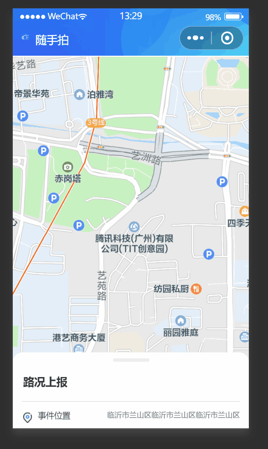

跟手拖动卡片胶囊固定顶部，下拉胶囊回到底部，是常见的页面交互。

<!--more-->

## 效果

先看效果：



## 技术分析

JavaScript给我们提供了三种重要的触摸事件，分别是

- 触摸开始 touchstart
- 移动中 touchmove
- 触摸结束 touchend

可以这样考虑，圈出用户所有能够移动到的位置totalDistance, 并且当触摸时动态调整卡片偏移cardOffset为触摸位置pageY


卡片初始位置使用绝对定位，相对page-body，top偏移938rpx；

使用 (当前触摸位置 与 总触摸区域高度 的比值) 乘 top 值作为卡片跟手移动距离。

```javascript
transform: `translateY(${ 938 * cardOffsetRate }rpx)`
```

在移动结束后，根据当前卡片所在的 触摸区域位置 决定卡片固定底部还是顶部。

```javascript
Math.abs(cardOffsetRate) > 0.5 ? 'up' : 'down' 
```


## 代码实现


有了上面的分析，代码写起来也就水到渠成了。

抽屉单独拎出来，胶囊bar不属于卡片内容，算header。绑定三大触摸事件

```html
<!-- views/report.vue -->
<template>
  <view class="page-suishoupai-detail">
    <CustomNavBar class="custom-nav-bar-cmp" />
    <view class="page-body">
      <view class="map-wrap">
        <map
          id="myMap"
        ></map>
      </view>

      <view
        class="popup-card"
        :style="{ transform: `translateY(${938 * cardOffsetRate}rpx)` }"
        :class="{ setCardTransition }"
      >
        <view
          class="card-bar-wrap"
          @touchstart="onTouchStart"
          @touchend="onTouchEnd"
          @touchmove="onTouchMove"
        >
          <view class="popup-bar"> </view>
        </view>
        <view class="card-inner">
         	<!-- 表单... -->
        </view>
      </view>
    </view>
  </view>
</template>
```

对于事件的处理：

```typescript
// views/report.vue
import { ref, nextTick, unref, onMounted } from 'vue'
import { getWXDom } from '@/utils/uniapi'

// 触摸区域 与 触摸位置 的比值 （不含navbar)
const cardOffsetRate = ref(0)
let startY = 0 //获取手指最顶部的Y坐标
// 控制固定顶部/底部动画
const setCardTransition = ref(false)
let totalDistance = 0

onMounted(async () => {
  // 计算总高度和navbar高度
  const instance = getCurrentInstance()
  await nextTick()
  const { height: headHeight = 65 } = (await getWXDom(instance, '.custom-nav-bar-cmp')) || {}
  const { top: cardOffsetTop = 465 } = (await getWXDom(instance, '.popup-card')) || {}
  totalDistance = cardOffsetTop - headHeight
  startY = cardOffsetTop
})
// 在触摸开始时,关闭transition过渡,防止有延时
const onTouchStart = function () {
  setCardTransition.value = false
}

const onTouchMove = function (e) {
  // 当前移动位置不算顶部navbar
  let moveY = e.touches[0].pageY - startY
  console.log(e.touches[0].pageY)
  // 计算当前触摸位置与总高度的比值
  const rate = moveY / totalDistance
  // 触摸位置溢出不做处理
  if (rate > 0 || rate < -1) return
  cardOffsetRate.value = rate
}

const onTouchEnd = () => {
  // 触摸结束后,开启transition过渡,准备吸顶/底
  setCardTransition.value = true

  const rate = unref(cardOffsetRate)
  // 根据当前触摸位置与总高度的比值,判断吸顶/底
  if (rate <= -0.5) {
    cardOffsetRate.value = -1
  } else {
    cardOffsetRate.value = 0
  }
}
```

上面用到的工具函数就不贴了，uniapp自带的获取dom元素简单包装了一下。


编辑器上测试还挺顺手的，但是到了真机运行，上拉正常，下拉就显得卡顿。

寻找优化手段，网上说把复杂结构封装成组件可以减少渲染次数，尝试把表单放到一个组件里引入，还是卡顿。

另外一种方法是用WXS来操作跟手动画，这个有待尝试。先挂着。