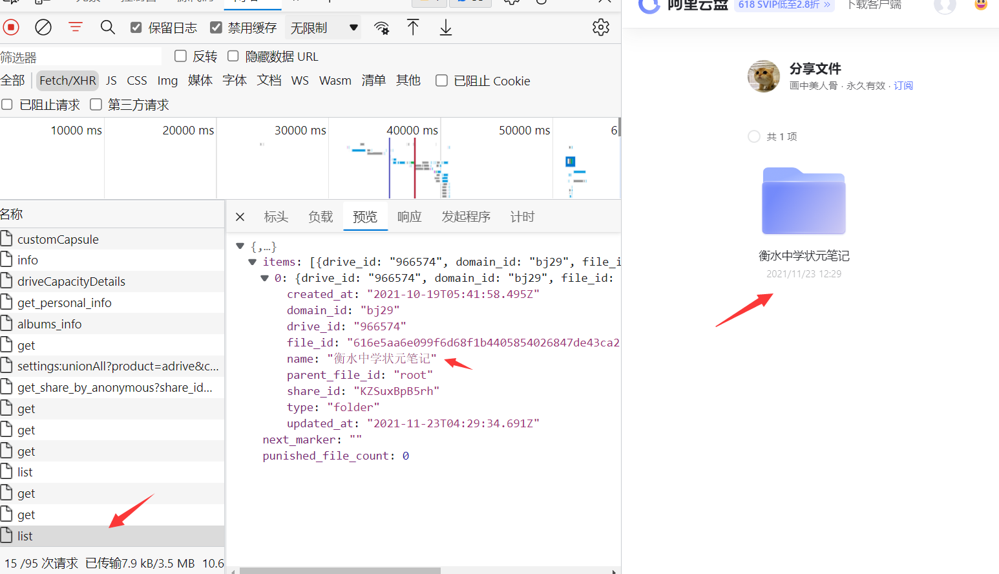

查资料每次都要点文件夹进去看看里面有啥，时常被空文件夹骗进去，为此，我写了个小脚本，用树列表展示文件目录！

<!--more-->

## 效果展示

效果：


即刻体验：[阿里云盘树状目录 (greasyfork.org)](https://greasyfork.org/zh-CN/scripts/446752-阿里云盘树状目录)

## 工具

编辑器：vscode

树状列表插件：[mar10/fancytree: JavaScript tree view / tree grid plugin with support for keyboard, inline editing, filtering, checkboxes, drag'n'drop, and lazy loading (github.com)](https://github.com/mar10/fancytree)

油猴脚本：[Greasy Fork - 安全、实用的用户脚本大全](https://greasyfork.org/zh-CN)

## 思路分析

检查请求，发现有查询文件列表接口



入参父级目录ID，返回父级目录下的文件和文件夹，使用 `type: folder` 标注文件夹类型

这样我可以写个递归把他们全跑出来，然后渲染成列表即可。


## 实现过程

仅仅截取一些代码片段

```javascript
// 获取文件列表
async function getList({ parent_file_id }) {
    const result = await fetch(
        "https://api.aliyundrive.com/adrive/v3/file/list",
        {
            headers,
            referrer: "https://www.aliyundrive.com/",
            referrerPolicy: "origin",
            body: JSON.stringify({
                share_id,
                parent_file_id: parent_file_id || "root",
                limit: 100,
                image_thumbnail_process: "image/resize,w_160/format,jpeg",
                image_url_process: "image/resize,w_1920/format,jpeg",
                video_thumbnail_process: "video/snapshot,t_1000,f_jpg,ar_auto,w_300",
                order_by: "name",
                order_direction: "DESC",
            }),
            method: "POST",
            mode: "cors",
            credentials: "omit",
        }
    );
    return await result.json();
}

// 遍历文件列表
async function buildTree(parent_file_id) {
    const treeNode = {};
    const root = await getList({ parent_file_id });
    treeNode.children = [];
    for (let i = 0; i < root.items.length; i++) {
        let node = void 0;
        if (root.items[i].type === "folder") {
            node = await buildTree(root.items[i].file_id);
            node.name = root.items[i].name;
        } else {
            node = root.items[i];
        }
        treeNode.children.push(node);
    }
    return treeNode;
}
```

分享一段从网上抄的代码，很厉害。

```javascript
// 等待指定dom加载完毕
(function () {
    var listeners = [];
    var doc = window.document;
    varMutationObserver =
        window.MutationObserver || window.WebKitMutationObserver;
    var observer;

    function domReady(selector, fn) {
        // 储存选择器和回调函数
        listeners.push({
            selector: selector,
            fn: fn,
        });
        if (!observer) {
            // 监听document变化
            observer = new MutationObserver(check);
            observer.observe(doc.documentElement, {
                childList: true,
                subtree: true,
            });
        }
        // 检查该节点是否已经在DOM中
        check();
    }

    function check() {
        // 检查是否匹配已储存的节点
        for (var i = 0; i < listeners.length; i++) {
            var listener = listeners[i];
            // 检查指定节点是否有匹配
            var elements = doc.querySelectorAll(listener.selector);
            for (var j = 0; j < elements.length; j++) {
                var element = elements[j];
                // 确保回调函数只会对该元素调用一次
                if (!element.ready) {
                    element.ready = true;
                    // 对该节点调用回调函数
                    listener.fn.call(element, element);
                }
            }
        }
    }

    // 对外暴露ready
    window.domReady = domReady;
})();
// 用法
domReady("div.container", function () {
    // 此时div.container已经渲染到页面上了
    // do sth...
});
```

解析cookie

```javascript
const parseCookie = (str) =>
    str
    .split(";")
    .map((v) => v.split("="))
    .reduce((acc, v) => {
        acc[decodeURIComponent(v[0].trim())] = decodeURIComponent(v[1].trim());
        return acc;
    }, {});
```


## 总结

一些代码很经典，不知道哪里有分享代码块的网站，每次都重写也太费时间了！

`Fancytree` 很不错，我直接抄过来就能用，上手也简单易懂。

过会添加个“点击文件夹跳转到页面功能”
