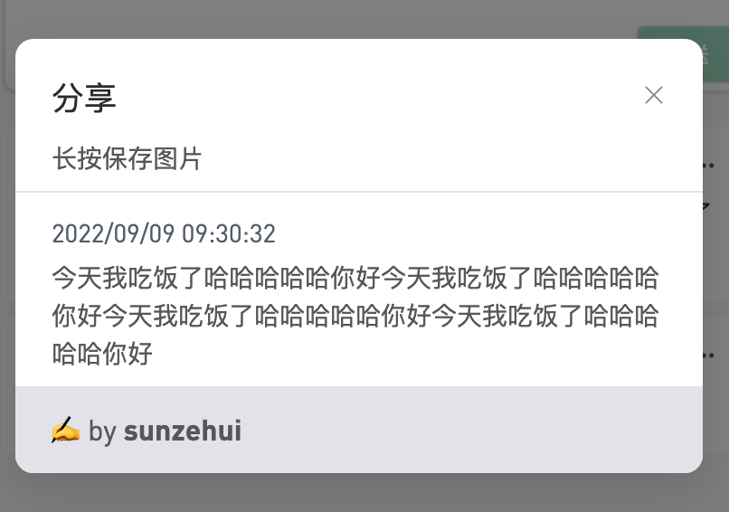
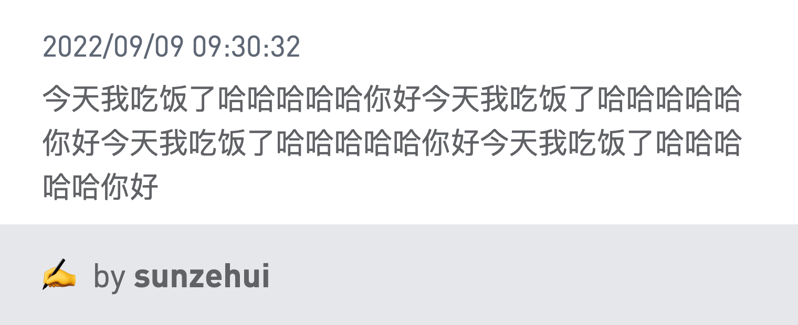
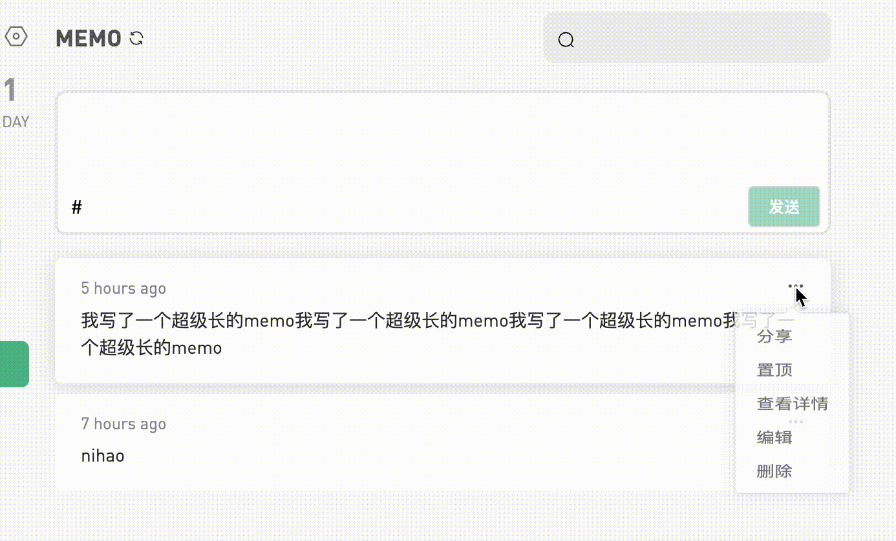

今天完善一下浮墨笔记，实现分享memo功能，需要创建海报图片，用html-to-image完美解决问题。

<!--more-->

仓库地址：[bubkoo/html-to-image: ✂️ Generates an image from a DOM node using HTML5 canvas and SVG. (github.com)](https://github.com/bubkoo/html-to-image)

## 实现

首先自己写好html，css就不展示了。。

```html
<div class="memo">
  <div class="content">
    <span class="time">2022/09/09 09:30:32</span>
    <span>
      今天我吃饭了哈哈哈哈哈你好今天我吃饭了哈哈哈哈哈你好今天我吃饭了哈哈哈哈哈你好今天我吃饭了哈哈哈哈哈你好
    </span>
  </div>
  <footer>✍️ by <b>sunzehui</b></footer>
</div>
```



我这里框架用的是`vue3`，在`onMounted`里拿到`dom`，然后生成图片。

```typescript
import { onMounted } from 'vue'
// dom ref 方便获取 dom
const memoRef = ref(null);
// 图片链接，生成好的图片放到这里
const imgUrl = ref(null);
onMounted(async () => {
  if (!show) return;
  await nextTick();
  const node = unref(memoRef);
  if (!node) return;

  // 转成 canvas 再转换 url
  htmlToImage
    .toCanvas(node, {
      pixelRatio: window.devicePixelRatio * 2,
      backgroundColor: "#eaeaea",
    })
    .then((canvas) => canvas.toDataURL())
    .then((url) => {
      imgUrl.value = url;
    })
    .catch(function (error) {
      console.error("oops, something wents wrong!", error);
    });
});
```

此时`template`里需绑定`ref`，并且添加展示图片的地方。

```html
<!--> 给根元素添加 ref </-->
<div class="memo" ref="memoRef">
  <!-- 此处图片绑定imgUrl变量 -->
  
  <div class="content">
    <span class="time">2022/09/09 09:30:32</span>
    <span>
      今天我吃饭了哈哈哈哈哈你好今天我吃饭了哈哈哈哈哈你好今天我吃饭了哈哈哈哈哈你好今天我吃饭了哈哈哈哈哈你好
    </span>
  </div>
  <footer>✍️ by <b>sunzehui</b></footer>
</div>
```

`img`元素在海报未生成完成时不应插入到`dom`中所以使用`v-if`。

为了方便展示，海报生成后立即覆盖原有`dom`层级显示，提示用户长按保存图片。


## 遇到的问题

图片模糊。

之前按照文档直接使用`htmlToImage.toPng`，生成的图片较为模糊，即使设置质量100%。

对比：

1. 直接生成png


2. 转换`canvas`后提取图片`base64`




## 效果

## 

或许需要加个`loading`😐
