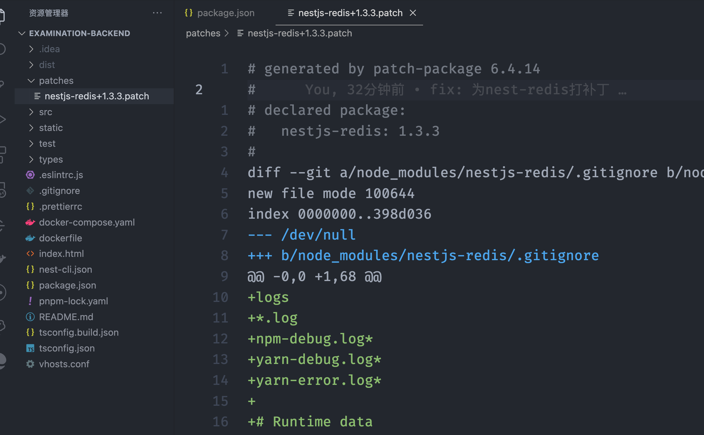
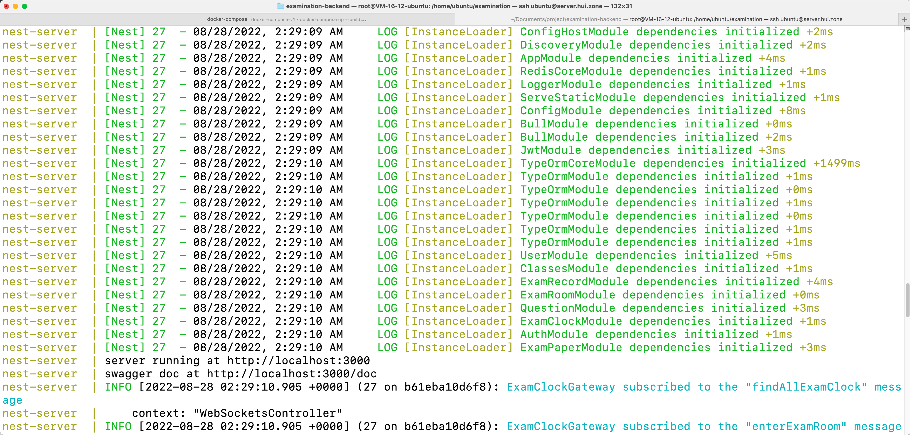

最近用到一模块，在`nestjs8`以上版本不兼容，作者鸽了，思考了几种方法后，选择使用打补丁工具适配。

<!--more-->

## 背景

该模块叫`nest-redis`，当初自己封装redis模块无力，用人家写好的。

安装后启动不了，

```bash
[Nest] 2697522 - 07/09/2021, 12:43:37 AM ERROR [ExceptionHandler] Nest can't resolve dependencies of the RedisCoreModule (Symbol(REDIS_MODULE_OPTIONS), ?). Please make sure that the argument ModuleRef at index [1] is available in the RedisCoreModule context.

Potential solutions:

If ModuleRef is a provider, is it part of the current RedisCoreModule?
If ModuleRef is exported from a separate @module, is that module imported within RedisCoreModule?
@module({
imports: [ /* the Module containing ModuleRef */ ]
})
```

翻了`Issues`，是`nestjs8`以上不兼容，有大佬提了PR，作者也合并了，但是没发布到npm上，所以现在装的版本是未修复的，只能选择引用`github`上面的模块来使用。

写法如下

```json
// package.json
{
  "dependencies": {
    "nestjs-redis": "github:skunight/nestjs-redis",
  },
}
```

你会发现这样写没有指定版本，万一以后更新了仓库，又会出现其他问题，具体到提交版本的写法如下

```json
// package.json
{
  "dependencies": {
    "nestjs-redis": "github:skunight/nestjs-redis.git#nest8-fix",
  },
}
```

成功解决问题，但今天我把项目部署到服务器上，服务器安装这个模块的时候一直报错，一定是网络的问题，这个可不好解决，然后就想到了手动打补丁。

## 打补丁

在`Issue`中有回复

> [@rares-lupascu](https://github.com/rares-lupascu) Nice workaround for local 😎 !!
>
> But for production, when can we expect a fix on this?

You can use [npmjs.com/package/patch-package](https://www.npmjs.com/package/patch-package)

```
npx patch-package nestj-redis
```

This will apply your changes every time you install or reinstall the package

https://github.com/skunight/nestjs-redis/issues/82#issuecomment-1219211659

然后我就发现了这个模块：`patch-package`

现在该模块有两个版本，未适配版本和已适配版本。

`patch-package`会从`npm`上拉取当前项目所用到的原始版本，与本地项目的`node_modules`中的模块做`diff`，记录所有与原始版本不一致的地方，保存到`patches`里。

所以我现在要把`packeage.json`的版本改回`npm`中的版本，与当前`node_modules`做`diff`

```bash
npm install patch-package
npx patch-package nestj-redis
```

（目前版本只能使用`yarn/npm`，如何使用`pnpm`后面说）

此时项目中有：



这个就是目前`node_modules`中的模块与npm中的模块的diff文件了。

在安装之前执行一下`patch-package`即可恢复至修改后的模块源码。

在`package.json`添加`postinstall`

```json
{
  ...
  "scripts": {
    "postinstall": "patch-package"
  },
}
```

关于`postinstall`

[npm scripts 官方文档（译） - SegmentFault 思否](https://segmentfault.com/a/1190000008832423)


## 解决

自然是成功在服务器上安装并启动成功！


