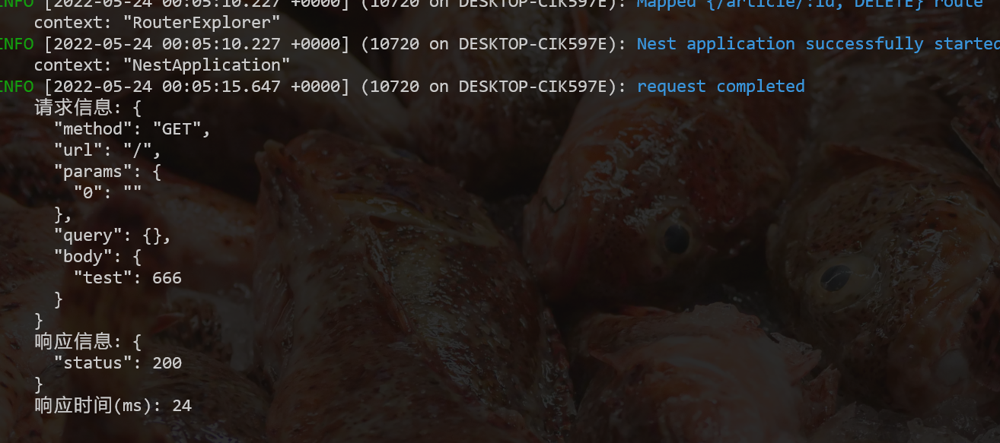
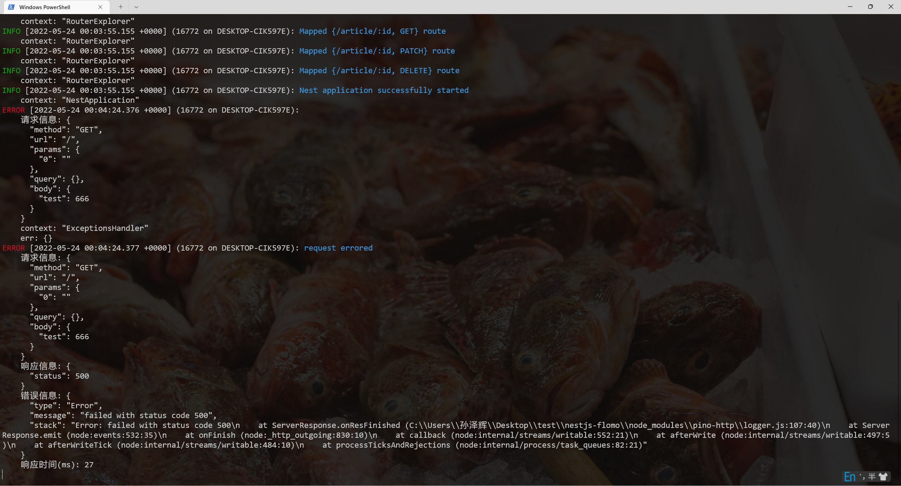

记录日志很重要，正如Apache软件基金会所说：没有错误日志的任何问题的故障排除就像闭着眼睛开车一样。

<!--more-->

`nodejs`中主流日志记录插件，如`log4js`,`winston`,`pino`，试了`log4js`，有些问题没能解决，最终听从群友建议，使用`pino`。理由是：配置方便，美化日志好看！


## 安装

nestjs-pino 是基于pino封装的nest模块,可以拿来即用!

```bash
yarn add nestjs-pino
# pino 日志美化工具
yarn add -D pino-pretty
```


在`main.ts`

```typescript
import { NestFactory } from '@nestjs/core';
import { TransformInterceptor } from './core/interceptor/transform.interceptor';
import { AppModule } from './app.module';

import { ConfigService } from '@nestjs/config';
import { Logger } from 'nestjs-pino';
async function bootstrap() {
  // 关闭默认logger
  const app = await NestFactory.create(AppModule, {
    bufferLogs: true,
    logger: false,
  });
  app.useLogger(app.get(Logger));
    
  const configService = app.get(ConfigService);
  await app.listen(configService.get('port'));
  return configService;
}
bootstrap().then((configService) => {
  console.log(
    `应用程序接口地址： http://localhost:${configService.get<number>('port')}`,
  );
  console.log('🚀 服务应用已经成功启动！');
});
```

`main.ts`中引入`nestjs-pino`，将默认`Logger`替换

继续在`app.module.ts`中配置`nest-pino`：

```typescript
import { Module } from '@nestjs/common';
import { AppController } from './app.controller';
import { AppService } from './app.service';

import { LoggerModule } from 'nestjs-pino';
import { pinoHttpOption } from './logger.config';

@Module({
  imports: [
    LoggerModule.forRootAsync({
      imports: [ConfigModule],
      inject: [ConfigService],
      useFactory: async (configService: ConfigService) => {
        return { pinoHttp: pinoHttpOption(configService.get('NODE_ENV')) };
      },
    }),
	// ...
  ],
  controllers: [AppController],
  providers: [AppService],
})
export class AppModule {}
```

使用`useFactory`为其注入原生`pino`的配置信息，为方便整理，将`pinoHttp`的配置信息拎出去了

在`logger.config.ts`

```typescript
import { Request, Response } from 'express';
import {
  SerializedError,
  SerializedRequest,
  SerializedResponse,
} from 'pino-std-serializers';
export function pinoHttpOption(envDevMode = 'development') {
  return {
    customAttributeKeys: {
      req: '请求信息',
      res: '响应信息',
      err: '错误信息',
      responseTime: '响应时间(ms)',
    },
    level: envDevMode !== 'production' ? 'debug' : 'info',
    customLogLevel(_: Request, res: Response) {
      if (res.statusCode <= 300) return 'info';
      return 'error';
    },
    serializers: {
      // 自定义请求日志
      req(_req: SerializedRequest) {
        const santizedReq = {
          method: _req.method,
          url: _req.url,
          params: (_req.raw as Request).params,
          query: (_req.raw as Request).query,
          body: (_req.raw as Request).body,
        };
        return santizedReq;
      },
      res(_res: SerializedResponse) {
        const santizedRes = {
          status: _res.statusCode,
        };
        return santizedRes;
      },
      // 自定义错误日志
      err(_err: SerializedError) {
        const santizedErr = {
          ..._err,
        };
        return santizedErr;
      },
    },
    transport: {
      target: 'pino-pretty',
      // 美化插件配置
      options:
        envDevMode === 'development'
          ? {
              colorize: true, // 带颜色输出
              levelFirst: true,
              // 转换时间格式
              translateTime: 'yyyy-mm-dd HH:MM:ss.l o',
            }
          : {
              colorize: false,
              levelFirst: true,
              translateTime: 'yyyy-mm-dd HH:MM:ss.l o',
              //  保存日志到文件
              destination: './log/combined.log',
              mkdir: true,
            },
    },
  };
}
```

注意：保存到文件时一定要把`colorize`关掉，不然有些控制字符在文件里，大概是控制颜色的字符。


插件仓库：

[iamolegga/nestjs-pino: Platform agnostic logger for NestJS based on Pino with REQUEST CONTEXT IN EVERY LOG (github.com)](https://github.com/iamolegga/nestjs-pino)

[pinojs/pino-pretty: 🌲Basic prettifier for Pino log lines (github.com)](https://github.com/pinojs/pino-pretty)

[pinojs/pino: 🌲 super fast, all natural json logger (github.com)](https://github.com/pinojs/pino)

nestjs-pino是pino的封装，一般它文档缺少的可以去看一下pino的，就这样。


## 效果

效果还ok，我的需求能看清请求信息就可以了

### 成功响应：



### 失败响应




## 参考：

[(88条消息) NestJS 7.x 折腾记: (3) 采用nestjs-pino作为Nest logger_crper的博客-CSDN博客](https://blog.csdn.net/crper/article/details/109582526)