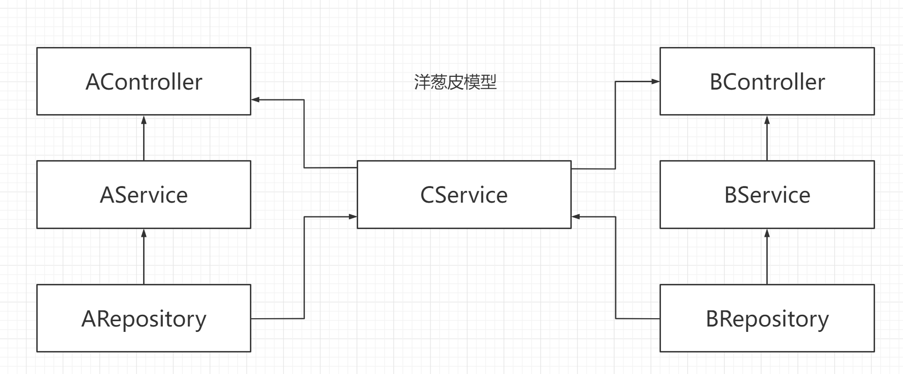

今天写代码写出循环依赖了，水平有待提高，总结一下我的收获。

<!--more-->

## 什么是循环依赖

现在有两个`Service`，他们之前互相引用，A 引用 B，B 引用 A，此时程序创建 A 实例时，需要注入 B，而又创建新的 B 时，发现又要注入 A 的实例，代码语言如下：

```typescript
// a.service.ts
@Injectable()
export class AService {
  constructor(
    private readonly bService: BService,
  ) {}
}
// b.service.ts
@Injectable()
export class BService {
  constructor(
    private readonly aService: AService,
  ) {}
}
```

`Nestjs` 给我报错找不到模块，问我是不是没注入，其实是循环依赖了。

[TL;DR](#解决方法3)

## 解决方法1

很简单呀，不引入 B 服务就好了呀，引入 B 的`Repository`，在 A 里自己查询就是了。

确实可行，也不报错了，但是这样本该划分的模块被糊在一块了，乱糟糟的，直接不能复用了，有没有一种优雅一点的方法？


## 解决方法2

`Nestjs`给出了一个语法，使用`forwardRef`，文档地址在这：[循环依赖 · Nest.js 中文文档 · 看云 (kancloud.cn)](http://static.kancloud.cn/juukee/nestjs/2671117)

文档说了，不建议用这个东西，放弃。


## 解决方法3

这是大佬指点的，我最终采用的这种方法。

在服务 A 和 B 之间合并一套方法来，把一些相交叉的逻辑抽出来，放到一个服务 C 去做，服务 C 不再调用 A 和 B 的方法，使用 A 和 B 的`Repository`来增删改查。

这就相当于下图（随便画画）：



正常是数据库操作最底层，这时新建的服务C直接引入循环引用的两个服务A、B的仓库，在服务 C 中去做有关A、B的操作，服务 A、B 需要使用冲突方法时，便可引入服务 C，此时不会发生循环依赖。