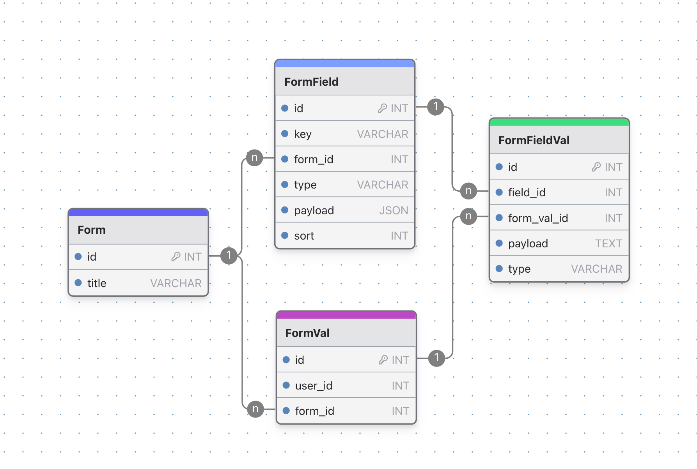

最近做的小程序关于表单的字段需要用户自定义编辑功能，这个表单编辑是整个项目的重点。

选择一个靠谱的表单编辑器，然后实现表单的数据处理是不得不深入研究的问题。

<!--more-->

总的来说，自定义表单程序至少需要：设计器（支持拖拉拽修改各种参数）、数据管理（用户填写的表单数据进行处理）


## 展示层面

表单展示层面分为后台设计表单和用户填写表单页面。

### 表单编辑器 form-create

经过调研，我决定使用这款表单生成组件：form-create。

对，他是个组件，读取配置列表就可以生成不同类型的表单项，这种方式存储方便，展示也方便（没涉及复杂的功能）

> **form-create 是一个可以通过 JSON 生成具有动态渲染、数据收集、验证和提交功能的表单生成组件。支持5个UI框架，并且支持生成任何 Vue 组件。内置20种常用表单组件和自定义组件，再复杂的表单都可以轻松搞定。**

form-create: [xaboy/form-create: 强大的动态表单生成器|form-create is a form generation component that can generate dynamic rendering, data collection, verification and submission functions through JSON. (github.com)](https://github.com/xaboy/form-create)


项目简介中说到：支持5个UI框架，分别是：

- **element-plus**
- **ant-design-vue**
- **naive-ui**
- **arco-design**
- **tdesign**

嗯，没有小程序版本，我们用的小程序是`Vue3 + uniapp`，项目作者虽说后续会支持小程序，但是我们等不了他了，自己手动实现好了。

**实现思路大概是：编辑出来表单JSON，前台去读取渲染**

其中作者实现了编辑器，通过form-create组件去渲染表单。

form-create-designer: [xaboy/form-create-designer: 好用的vue可视化表单设计器 (github.com)](https://github.com/xaboy/form-create-designer)


编辑器预览的样式是`element-ui`的，无所谓，我们用的是小程序，能生成配置，让我们小程序读到就可以了。

输入框JSON格式示例：

```json
{
    type: "input",
    title: "商品名称",
    //label名称
    field: "goods_name",
    //字段名称
    value: "",
    //input值,
    props: {
      "type": "text",
      //输入框类型，可选值为 text、password、textarea、url、email、date
      "clearable": false,
      //是否显示清空按钮
      "disabled": false,
      //设置输入框为禁用状态
      "readonly": false,
      //设置输入框为只读
      "rows": 4,
      //文本域默认行数，仅在 textarea 类型下有效
      "autosize": false,
      //自适应内容高度，仅在 textarea 类型下有效，可传入对象，如 { minRows: 2, maxRows: 6 }
      "number": false,
      //将用户的输入转换为 Number 类型
      "autofocus": false,
      //自动获取焦点
      "autocomplete": "off",
      //原生的自动完成功能，可选值为 off 和 on
      "placeholder": "请输入商品名称",
      //占位文本
      "size": "default",
      //输入框尺寸，可选值为large、small、default或者不设置,
      "spellcheck": false,
      //原生的 spellcheck 属性
      "required": false,
    },
    validate: [{
      required: true,
      message: '请输入商品名称',
      trigger: 'blur'
    }
  ]
}
```

其中`props`在编辑器面板右侧可以编码处理，这个是我定义的姓名表单项：用户可以配置placeholder，是否可清空，是否禁用，是否只读....... 当然你可以加任何属性，业务上的也不耽误渲染。

```javascript
import uniqueId from '@form-create/utils/lib/unique'
import { localeProps, makeRequiredRule, makeHiddenRule } from '@/utils'
import phoneCmp from '@/components/form-item/phone.vue'
const label = '姓名'
const name = 'name'

export default {
  icon: 'icon-input',
  label,
  name,
  rule({ t }) {
    return {
      type: name,
      field: uniqueId(),
      title: label,
      info: '',
      $required: false,
      props: {},
    }
  },
  component: phoneCmp,
  props(_, { t }) {
    return localeProps(t, name + '.props', [
      makeRequiredRule(),
      {
        type: 'input',
        field: 'placeholder',
        title: '输入框占位文本',
      },
      { type: 'switch', field: 'clearable', title: '是否可清空' },
      { type: 'switch', field: 'disabled', title: '禁用' },
      { type: 'switch', field: 'readonly', title: '是否只读' },
    ])
  },
}
```


### `uniapp` 小程序端

小程序端因为设计器没有实现UI库适配，我使用相对稳定一些的`uni-ui`，相对比其他的功能少点，样式差点，不过这都不重要。

基本上，拿到了配置后走个`v-for`循环渲染一下表单项就可以了，大概是：

```html
<!-- diy-form -->
<template>
  <uni-forms ref="baseFormRef" label-position="top" :rules="diyRules" :modelValue="diyFormPayload">
    <formItem
      v-for="item in formList"
      :key="item.id"
      :field="item"
      @change-data="changeOtherData"
    />
  </uni-forms>
</template>
```

`uni-forms`可以接收我自定义的`rule`，表单规则是根据生成的配置进行生成的，在尽量适配`uni-ui`的方式去实现，比如`required`，邮箱、身份证、手机号之类的验证，都是根据表单项中的参数来确定的。

对于表单项组件，为各种表单项添加`v-if`进行类型判断分别渲染。

重点说一下数据的流动：

`uni-forms`动态传入的`rule`，需要在`onReady`之后触发`setRules()`方法（最早要晚于`ready`）。

所以在生成自定义rule后要调用一下`setRules()`，但是请求可能早于`onReady`，那就在`onReady`同时调用一次即可。

```typescript
onReady(() => {
  initForm()
})
watch(formList, () => {
  initForm()
})
```

从`diy-form`传来的`field`，经过`computed`处理一层统一适配`form-item`

```javascript
// form-item.vue
const _field = computed(() => {
  const field = props.field
  return {
    ...field,
    ...(field?.props || {}),
    required: field.$required != false,
    readonly: field?.props?.readonly,
    disabled: field?.props?.disabled || field?.props?.readonly || false,
    placeholder: field?.props?.placeholder || `请输入${field.title}`,
    type: field.type
  }
})
```

这里的`formVal`是要绑定到表单项的，表单项的值要通过刚才说的`uni-forms`中绑定的`modelValue`中获取，所以为了不用统一传递，我直接从`uni-forms`中读取了。

修改也同样，直接改`uni-forms`中的`modelValue`即可。

```typescript
const emit = defineEmits(['changeData'])
const formVal = computed({
  get: () => {
    const form = inject<any>('uniForm')
    let formVal = form._getDataValue(_field.value.field, form.localData)
    return formVal
  },
  set: (val) => {
    emit('changeData', _field.value.field, val)
  }
})
```

最后，给`diy-form`组件暴露两个方法：验证表单和更新表单数据。

```typescript
defineExpose({
  validate: async () => {
    // 验证表单规则，最终返回用户表单数据
  },
  updateData: (data) => {
    // 更新表单中的值
  }
})
```


## 数据管理

关于结构，分为：Form(表单模型)，FormField(表单模型字段)，FormVal(表单数据主表)，FormFieldVal(表单字段数据)

> 使用到的工具：[drawDB](https://drawdb.vercel.app)

其中`表单模型`存放表单主体，`表单模型字段`存储该表单中的所有字段
`表单数据主表`存放每个用户的表单数据，`表单字段数据`存放用户实际填写的表单数据

### 数据存储

前台获取表单时，查询`表单模型`所关联的业务ID，对应根据`表单模型`查出相应字段。
提交表单时，组装表单字段和表单值，后端通过前台提交的`表单字段`中的key查询对应表单字段，该key是自定义表单随机生成的，具有唯一性。整理后一同放入`表单数据主表`和`字段数据表`中。

后台编辑表单时，同样的对`表单模型`和`表单模型字段联表`管理。
查看用户表单数据，对`表单数据主表`和`表单字段数据联表`查出即可。

另外，对于前端提交的表单，需要进行规则验证，这里采取的方法是按照表单字段表中的type进行分类，去映射thinkphp自带规则以及自定义的规则，比较简单不贴代码了。

### 更新表单字段
对于后台编辑表单字段，保存时，有几种情况：
- 仅修改排序、字段属性
- 删掉表单某个字段
- 新增字段


最开始思路是直接把旧字段全部删掉，然后把现有字段添加上去。
但这样会导致问题：之前填写过的数据将会全都查不出来。
我们希望删掉的字段查不出来无所谓，但是没删过的数据要能查到。
所以加个diff：新与旧比较

- 现有字段则更新
- 新字段没有则删掉
- 新字段多出来则添加


附上代码
```php
/**
 * 更新表单字段
 */
public function updateFormField($payload)
{
    $form_id = $payload['form_id'];
    $form_list = $payload['form_list'];
    
    $formFieldDao = new FormField();
    // 查询之前所有的字段，如果存在则更新，不存在则删除
    $lastFields = $formFieldDao->where('form_id', $form_id)->select();

    // 计算新增字段，旧字段中不存在的新字段
    $newFields = [];
    foreach ($form_list as $idx => $item) {
        if (in_array($item['field'], array_column($lastFields, 'key'))) {
            continue;
        }
        $newFields[] = $item;
    }
    // newFields一定是新增的
    foreach ($newFields as $field) {
        $formFieldDao
          ->allowField(true)
          ->insert([
            'type' => $field['type'],
            'form_id' => $form_id,
            'sort' => $idx,
            'key' => $field['field'],
            'createtime' => time(),
            'payload' => json_encode($field, JSON_UNESCAPED_UNICODE),
        ]);
    }
    foreach ($form_list as $idx => $item) {
        // 此处更新
        $formFieldDao
          ->where('form_id', $form_id)
          ->where('key', $item['field'])
          ->update([
            'payload' => json_encode($item, JSON_UNESCAPED_UNICODE),
            'sort' => $idx
        ]);
        // 过滤掉更新过的
        $lastFields = array_filter($lastFields, 
          function ($field) use ($item) {
            return $field['key'] != $item['field'];
        });
    }
    // lastFields一定是删除的
    foreach ($lastFields as $field) {
        $formFieldDao->where('id', $field['id'])->delete();
    }
    
    // 旧版直接删掉之前的数据，然后添加新数据（已废弃）
    // if (isset ($form_id) && $form_id != '') {
    //     $formFieldDao->where('form_id', $form_id)->delete();
    // }
    // $toInsertData = [];
    // foreach ($form_list as $idx => $item) {
    //     $toInsertData[] = [
    //         'type' => $item['type'],
    //         'form_id' => $form_id,
    //         'sort' => $idx,
    //         'key' => $item['field'],
    //         'createtime' => time(),
    //         'payload' => json_encode($item, JSON_UNESCAPED_UNICODE),
    //     ];
    // }
    // $formFieldDao->allowField(true)->insertAll($toInsertData);
}
```

## 总结

关于后台编辑表单这里，最完美的解决方案应该是表单项删掉也不会导致查不出来数据，这让我想到直接隐藏即可，不是假删除，而是隐藏字段，后台也能看到被隐藏的字段，不过是前台不显示而已。
客户说存储空间有限，做成强制删除的，留一个隐藏按钮。作为两个方案的混合方案，这就结束了。

不足的地方：
- 表单规则应该支持自定义
- 适配更多字段
- 表单页面性能优化
- 后端安全防范
