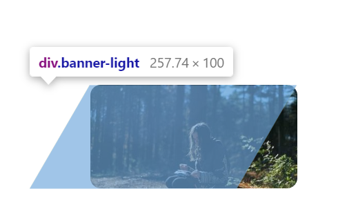
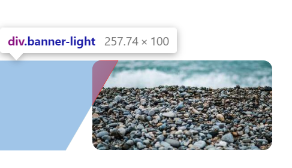

本来以为很简单的效果，当图片写成自适应的时候事情变得复杂了起来，目前只想到用JS脚本实现了，先挂到这里吧。	

<!--more-->

扫光效果预览


## 初步实现

代码是如此简单：

```html
<div class="container">
  <div class='banner'>
    <div class="img-wrap">
      </img>
		<!-- 划过的高光 -->
      <div class='banner-light'></div>
    </div>
  </div>
</div>
```

```scss
.container {
  $skewx: skewx(-30deg);

  @keyframes toshift {
    0% {
      transform: $skewx translateX(-200px);
    }
    100% {
      transform: $skewx translateX(400px);
    }
  }
}
html,
body,
.container {
  padding: 0;
  wdith: 100%;
  height: 100%;
}
.banner {
  overflow: hidden;
  position: relative;
  height: 100%;
  width: 100%;
  display: grid;
  place-items: center;
  .img-wrap {
    border-radius: 10px;
    overflow: hidden;
    // ！！图片宽度写死200，对应的平移位置与图片有关
    width: 200px;
    img{ height: 100%; width: 100%; object-fit: contain;}
  }
  .banner-light {
    position: absolute;
    left: -200px;
    top: 0px;
    width: 100%;
    height: 100%;
    background-image: -webkit-linear-gradient(
      0deg,
      rgba(255, 255, 255, 0),
      rgba(255, 255, 255, 0.5),
      rgba(255, 255, 255, 0)
    );
    transform: $skewx;
    animation: toshift 3s linear infinite;
  }
}
```

高亮部分设置线性渐变，整个高亮宽高同图片大小一致，斜切30度，从左往右平移。



## 继续优化

大屏适配中，图片一般不会直接写死宽高，通常的做法是垂直padding保证图片比例缩放，此时高光的位置也应该同图片保持同步。

如代码中标注：高光的平移位置与图片宽度有关，毕竟从左边往右移动，需要知道整个宽度是多少像素，然后才好加个负数完全偏移到左边让高光看不到。即：

```css
.banner-light{
    left: -1 * $image-wdith; // 代码中的图片是200px，所以我写的-200px
}
```

当然，往右移动的距离同样需要知道高光的宽度，不再赘述。

由上面代码知道，高光宽高是跟随图片宽高的，所以问题转变成了如何获取自适应的图片宽高。

你或许想说直接写`left: -100%`就好了，实则不然

```css
.banner-light{
    left: -100%;
    background: red;
}
```



经过斜切的`<div/>`，直接向左定位`-100%`并不包括全部宽度。

你会发现真正的宽度是`257.74px`！

怎么算的呢？[css - 如何计算skew后的偏移长度？ - SegmentFault 思否](https://segmentfault.com/q/1010000012918562###)


与思否上不同，我们要算的是侧边的大三角形对边长度。

框住的大三角形高度h=高光总高度，而斜边和临边的夹角a正是设置的`skewx(30deg)`，所以

对边的长度=$\frac{h*tan(a)}{2}$

此时求出来的是右侧三角形的宽度，而我们要算两侧总的偏移宽度，则需要*2，所以

高亮的宽度=$h*tan(a)$

带入计算一下，两侧偏移宽度=$100 * tan(\frac{\pi}{6})=100*\frac{\sqrt{3}}{3} = 57.7350269...$

最终加上图片宽度（并四舍五入），正好是`257.74`！

没想到吧，高光宽度竟然与高度有关！

反正我是没想出来`left: calc(??)`还能写出高光高度出来，目前已知的

写`100%`是高光宽度，偏移宽度=高光宽度*tan(30deg)+高光宽度

不想了，反正JS能写，有方法我再回来留上。。

## 2023年3月9日补充

偶然发现b站有骨架屏加载，正是高光效果，看到代码的那一刻感觉自己又钻到死胡同了，原来这么简单！

直接在垂直padding撑起图片高度的那个盒子上面添加旋转45度的渐变背景就可以了，至于动画，则修改`background-position`即可。

```css
.cover {
    background: linear-gradient(-45deg,var(--graph_bg_regular) 25%,var(--bg1) 45%,var(--graph_bg_regular) 65%);
    background-size: 400% 100%;
    animation: skeleton-loading 1.2s ease-in-out infinite;
}

@keyframes skeleton-loading {
    0% {
        background-position: 100% 50%
    }

    to {
        background-position: 0 50%
    }
}
```

