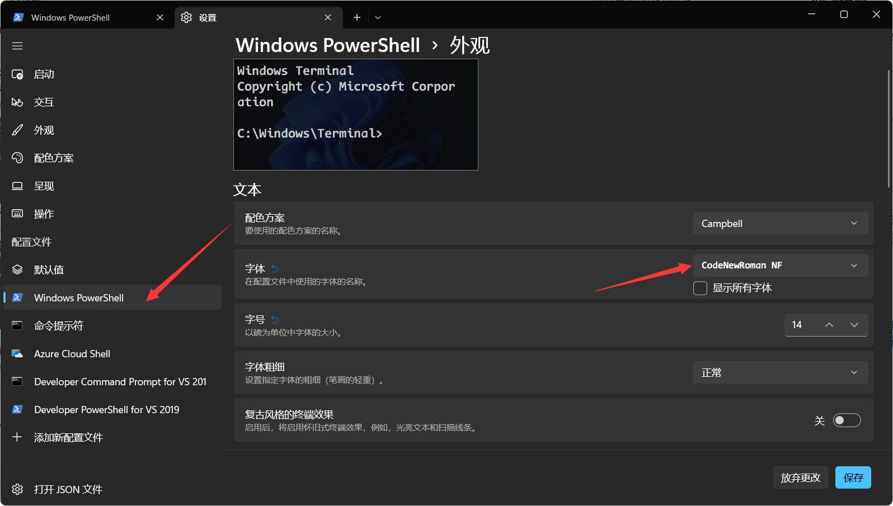

美化Powershell，为其添加命令别名。


<!--more-->

安装美化工具：

[Starship：可用于各种 Shell 的提示符](https://starship.rs/zh-cn/)

<video muted="muted" autoplay="autoplay" loop="loop" playsinline="" class="demo-video" style="width:100%"><source src="https://starship.rs/demo.webm" type="video/webm"> </video>

我系统里有cargo，直接一行命令装上了。

步骤我就不贴了，一定要注意换成 [Nerd Font (opens new window)](https://www.nerdfonts.com/)的字体，不然有些图标显示不出来，切换方法：





## 配置命令别名

输入`echo $profile`

```bash
❯ echo $profile
C:\Users\孙泽辉\Documents\WindowsPowerShell\Microsoft.PowerShell_profile.ps1
```

打开后缀是ps1的文件，像我这样添加别名

```bash
# 删除默认别名
Remove-Item Alias:ni -Force
# 添加别名
function ni {
    pnpm install
}
function np {
    hexo new post $args 
}
Invoke-Expression (&starship init powershell) # Initialize Starship
```

这个文件会在`Session`建立的时候执行，可以添加你想写的脚本

ni 是系统已经占用的了，所以我先把他删了后添加

效果：


## 添加历史记录提示

这种效果


[PowerShell/PSReadLine: A bash inspired readline implementation for PowerShell (github.com)](https://github.com/PowerShell/PSReadLine)

配置步骤：

安装最新版`PowerShellGet`（必装）

```bash
Install-Module -Name PowerShellGet -Force
```

安装提示插件

```bash
Install-Module PSReadLine -AllowPrerelease -Force
```

在之前`Microsoft.PowerShell_profile.ps1`中，添加

```bash
Set-PSReadLineOption -PredictionSource History # 设置预测文本来源为历史记录
Set-PSReadlineKeyHandler -Chord Tab -Function MenuComplete # 面板展示联想
```

