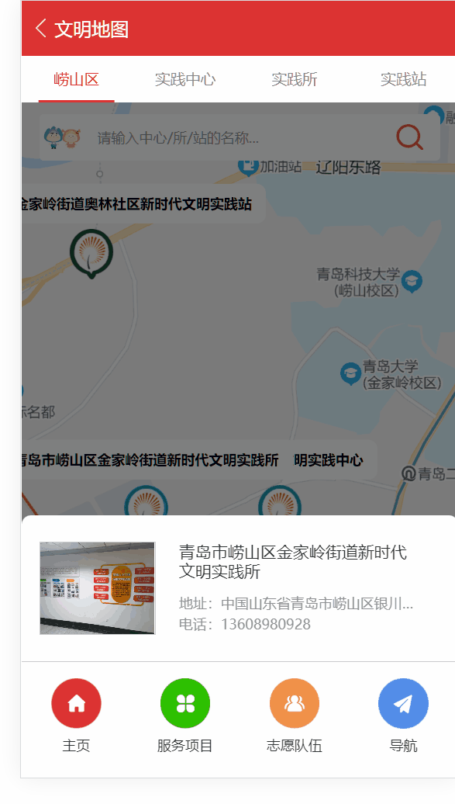

一直想做一种可以用函数触发显示组件，通过函数去控制组件的组件，参考vant的image-preview实现了一个导航软件菜单。

<!--more--> 

## 效果

点击导航按钮弹出三个平台的菜单，点击菜单项后跳转到导航链接。点击别处隐藏。




## 代码实现

实际上用组件来写很简单，但是我想让他随处可调，不单单是这个页面，别的页面的话我导入函数执行就给我弹出来，而不是像vant示例那样，导入组件到页面上，然后控制show/hide，很麻烦，弹窗多了不好管理。

[Vant 2 - 轻量、可靠的移动端组件库 (gitee.io)](https://vant-contrib.gitee.io/vant/v2/#/zh-CN/popup)

实现方法很简单，首先写好组件：

```vue
// components/RouterMapChoice/RouterMapChoice.vue
<script lang="ts" setup>
import { Cell, List, Popup } from 'vant'
import { computed, ref, unref } from 'vue'

type Text = string | number;
interface Platform {
  label: Text
  getUrl(title: Text, address: Text): Promise<string>
}
const props = defineProps<{
  dataList?: Platform[]
  title?: string
  address?: string
  showMask?: boolean
}>()

const dataList = computed(() => props.dataList || [])
const labelList = computed(() => unref(dataList).map(item => item.label))
const overlayStyle = computed(() => {
  let style = {}
  // 不显示遮罩
  if (!props.showMask)
    style = { background: 'transparent' }

  return style
})

const popupShow = ref(false)

const openRouter = async (type: string) => {
  const openUrl = await unref(dataList)
    .find(item => item.label === type)
    .getUrl({ title: props.title, address: props.address })
  window.open(openUrl)
}

defineExpose({
  show: () => popupShow.value = true,
  hide: () => popupShow.value = false,
  isShow: popupShow,
})
</script>

<template>
  <Popup v-model="popupShow" :overlay-style="overlayStyle" style="height: 35vh;padding-top: 40px" round class="map-choice-picker" position="bottom">
    <List>
      <Cell v-for="type in labelList" :key="type" is-link :title="type" @click="openRouter(type)" />
    </List>
  </Popup>
</template>

<style scoped>
.map-choice-picker{
  z-index: 999999!important;
}
</style>
```

关键的一步是创建一个ts/js文件，用Vue.extends编译出来组件`RouterMapChoiceCmp`，插入到body上，便可以操作组件实例来控制页面上的组件。

```typescript
// components/RouterMapChoice/index.ts
import { assign } from 'lodash-es'
import Vue from 'vue'
import RouterMapChoiceCmp from './RouterMapChoice.vue'

let instance: null | typeof RouterMapChoiceCmp = null
const defaultConfig = {
  title: '标记位置',
  showMask: true,
  dataList: [],
}

interface CmpProps {
  dataList?: any[]
  title?: string
  address?: string
  showMask?: boolean
}

const initInstance = function initInstance() {
  instance = new (Vue.extend(RouterMapChoiceCmp))({
    el: document.createElement('div'),
  })
  document.body.appendChild(instance.$el)
}

const RouterMapChoice = function RouterMapChoice(options: CmpProps) {
  if (!instance)
    initInstance()
  assign(instance, defaultConfig, options)
  instance.show()

  return instance
}

RouterMapChoice.Component = RouterMapChoiceCmp

RouterMapChoice.install = function () {
  Vue.use(RouterMapChoiceCmp)
}

export default RouterMapChoice
export interface Platform {
  label: Text
  getUrl(options: { title: Text; address: Text }): Promise<string>
}
```

现在即可使用函数调用该组件了。

```typescript
import RouterMapChoice from '@/components/RouterMapChoice';

onMounted(()=>{
    RouterMapChoice({
        dataList: 
           //xxx(此处省略200个字),
        showMask: false
    });
})
```

## 继续优化

上面使用实例需要传入特别长的dataList（如果有很多导航平台的话），导致页面代码不够整洁，不方便阅读。

为了方便在页面调用干净利索，为组件写一份CompositionAPI，方便调用即可。

```typescript
// composables/useRouterMapChoice.ts
import type { Position } from '@/types/map'
import request from '@/utils/request'
import RouterMapChoice from '@/components/RouterMapChoice'
import type { Platform } from '@/components/RouterMapChoice'
interface ShowMapOption {
  title: string
  address: string
  showMask?: boolean
  position: Position
}

/**
 * @description: 坐标转换API
 * @param type 导航软件类型
 * @param pos 坐标 { lat, lng}
 * @constructor
 */
const ApiTransformPos = async (type: number, pos: Position) => {
  return await request({
    url: '/index/coordinate_transformation',
    method: 'post',
    data: {
      type,
      longitude: pos.lng,
      latitude: pos.lat,
    },
  }) as unknown as { longitude: string; latitude: string }
}

export const useRouterMapChoice = () => {
  const showRouterMap = ({
    title = '', address = '', showMask = true,
    position,
  }: ShowMapOption) => {
    const { lat, lng } = position
    const dataList: Platform[] = [
      {
        label: '百度地图',
        getUrl: async ({ title, address }) => {
          return `https://api.map.baidu.com/marker?location=${lat},${lng}&title=${title}&content=${address}&output=html`
        },
      },
      {
        label: '高德地图',
        getUrl: async ({ title }) => {
          const { longitude, latitude } = await ApiTransformPos(1, { lat, lng })
          return `https://uri.amap.com/marker?position=${longitude},${latitude}&name=${title}&src=appname&coordinate=gaode&callnative=0`
        },
      },
      {
        label: '腾讯地图',
        getUrl: async ({ title, address }) => {
          const { longitude, latitude } = await ApiTransformPos(2, { lat, lng })
          return `https://apis.map.qq.com/uri/v1/marker?marker=coord:${latitude},${longitude};title:${title};addr:${address}&referer=myapp`
        },
      },
    ]
    return RouterMapChoice({
      title,
      address,
      dataList,
      showMask,
    })
  }
  return { showRouterMap }
}

```

在页面中调用

```typescript
// views/Map.vue
import { useRouterMapChoice } from '@/composables/useRouterMapChoice';

const { showRouterMap } = useRouterMapChoice();
const handleMapIconClick = () => {
    showRouterMap({
        title: '这是我的位置',
        address: '中国山东省',
        showMask: false,
        position: {
            lat,lng
        }
    })
}
```

简化了很多！