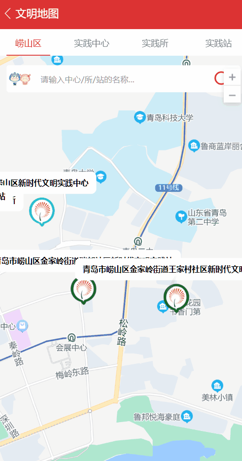
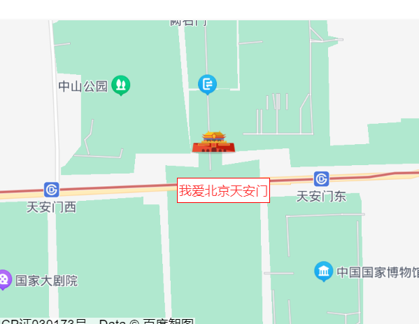
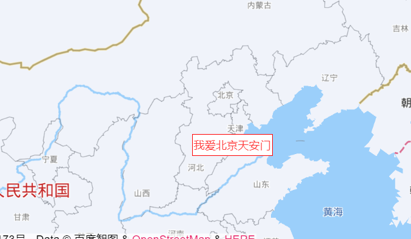
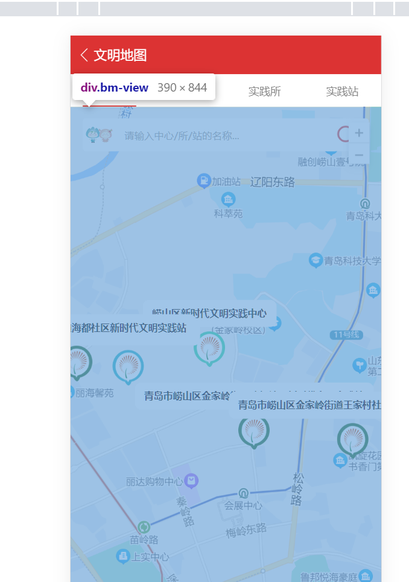
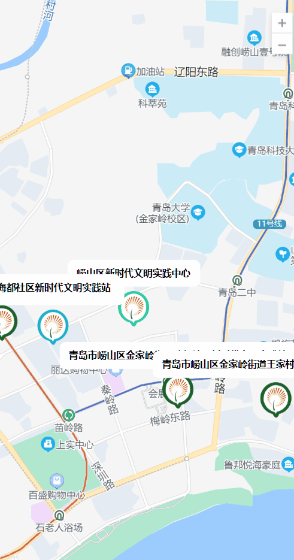
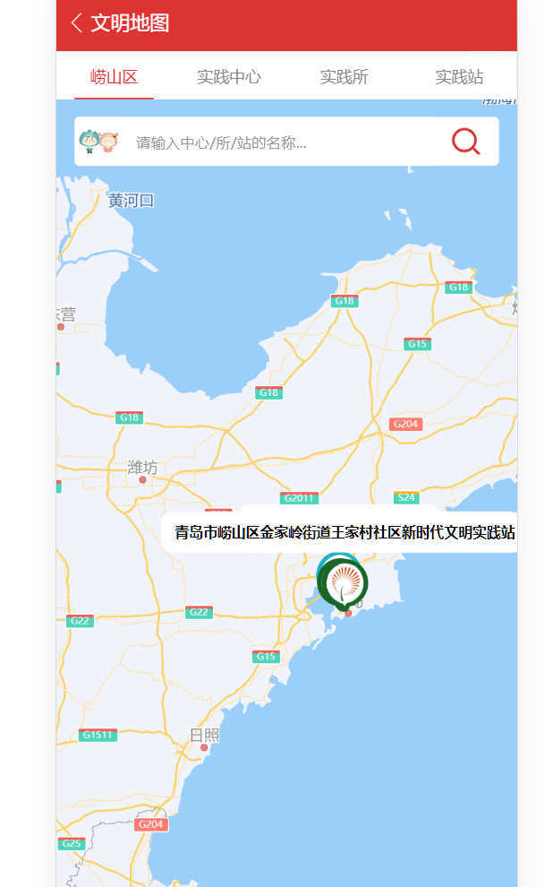

百度地图添加了overlay后，开启缩放，在缩放时会出现坐标不正确的状况，搞了一下午，很费解。

<!--more-->

## 问题复现



之前是缩放图标往下偏，不知道怎么搞的成往上了。


## 解决

自己去`vue-baidu-map-plus`文档上看，发现示例也有偏移问题。。

示例在zoom放到很大的时候：



示例在缩小的时候：



可以看到这个字已经快飘到山东上了。


网上看文章说是缩放的时候把滚动条也往下拖了，所以位置偏移。这个跟我情况不一致，我所有父元素都写了overflow-hidden，不存在滚动条。

或者添加zoom导航条，不再使用滚轮缩放，用导航条+和-来缩放，事实证明也不行，问题的根源还是位置计算上，跟滚动无关。


最终按照自己的理解，保证地图占满屏幕，不会出现位置计算有偏移的情况。



蓝色区域是百度地图的容器，为了能让他占满，把上面tabbar和title全注释了。然后问题就解决了。。。



想到这里已经不难了，将刚才注释的那些使用fixed固定到顶部就可以了。

为了方便，我为他们包一层`.overtop`

```css
.overtop{
  position: fixed;
  top: 0;
  left: 0;
  right: 0;
  z-index: 999999;
}
```

最终完美解决：



解决后还是不太明白，为什么一定就要按照屏幕去计算，关键计算代码应该是这里

```javascript
// MapPoint.vue
const draw = ({ el, BMapGL, map }) => {
  if (!props.position) return;

  const { lng, lat } = props.position;
	// 经纬度转换屏幕坐标
  const pixel = map.pointToOverlayPixel(new BMapGL.Point(lng, lat));
  el.style.left = pixel.x - 40 + "px";
  el.style.top = pixel.y - 40 + "px";
};
```

没找到好的示例，别人都能跑我不行，先搁置吧。