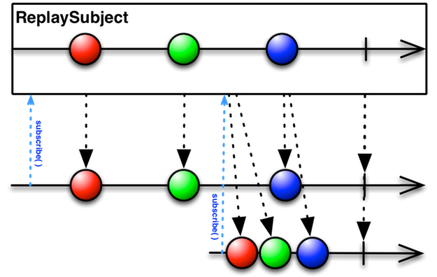

前端划分组件后，想要实现代码耦合度低并且井然有序，就必须认识常见模块间通信方式的实现及其优缺点，准确把握应用场景，在复杂与简单之间寻找平衡。

<!--more-->

推荐了解：[⚔️ Cross micro frontends communication 📦 - DEV Community](https://dev.to/luistak/cross-micro-frontends-communication-30m3)

前端模块间通信方式大致5种：

- web workers
- props & callbacks
- custom events
- pub/sub library
- 结合场景自行实现通信

其中web workers我不经常使用，后面4个皆有在最近做的项目中使用到，简单讲讲用到的场景以及使用感受。

## 前端模块间通信方式

### props & callback

比如父页面弹出iframe子窗口

父传子：父页面打开子窗口之前可以通过设置一个全局变量，子窗口加载时去读全局变量，此时就是最新的数据

子传父：子窗口可以调用父页面的全局函数，将自己内部的数据传回父页面。

```javascript
// index.html 父页面
window.props = {
    message: 'hello'
}
window.setProps = val => Object.assign({}, window.props, val)
layer.open('./dialog.html');

// dialog.html 子窗口
console.log(parent.props) // hello
parent.setProps({
    message: 'world'
})
```

优点：这种方式最直接，最容易接受，也是最常见的手段。

缺点：没有工程化框架时（如Vue, React...）只能依赖全局变量共享，全局变量本身带有局限性。


### custom event

js原生支持自定义事件，你可以在任何时机发布自己的事件并携带数据。因此，可以使用其进行通信。

父页面：加载API数据到达，向全局发送'data-loaded'事件。

依赖API数据的页面：监听‘data-loaded’，对数据处理。

```javascript
// main.js
request().then(result => {
    const customEvent = new CustomEvent('data-loaded', { result });
    window.dispatchEvent(customEvent)
});
// card.js
window.addEvevntListener('data-loaded', result => {
    result.map( /* do something... */)
})
```

优点：不依赖全局变量，不限于框架/原生，因为自定义事件原生支持

缺点：如果监听事件比触发事件晚了（触发事件时还没来得及监听），会导致收不到事件；编码难度较高，需要有代码设计能力。


### pub/sub library

依靠基于pub/sub模式的代码库可以轻松实现页面间通信，用的比较顺手的rxjs足够应付大多数场景，最近也用到了其中的subject。

父页面：创建可观察对象，管理数据增删改查，而不关心视图结构。

子页面：订阅可观察对象，依据父页面数据渲染页面。

```javascript
// main.js
window.subject = new rxjs.BehaviorSubject([]);
request().then(result => window.subject.next(result))

// card.js
window.subject.subscribe(
	val => render(val)
)
```

优点：简单直接，代码轻量；rxjs本身很强大，可处理复杂场景；

缺点：依赖rxjs增加页面负担；同自定义事件类似


## 触发事件晚于监听事件解决办法

在RxJS中，可以使用Subject来实现监听者和监听的功能。如果要监听监听者触发监听之前的更新，可以将监听者的更新先存放在一个数组中，然后在Subject进行订阅时，先将存放的更新发送出去，再将Subject本身加入到监听者中，以便后续的更新可以被Subject监听到。

```typescript
import { Subject } from 'rxjs';

class Listener {
  private updates: any[] = [];
  private subject = new Subject();

  addUpdate(update: any) {
    this.updates.push(update);
  }

  listen() {
    // 发送之前的更新
    this.updates.forEach((update) => this.subject.next(update));

    // 加入Subject进行后续的监听
    this.subject.subscribe((update) => console.log('update:', update));
  }

  update(update: any) {
    this.addUpdate(update);
    // 触发监听
    this.listen();
  }
}

const listener = new Listener();

// 更新之前，先监听
listener.listen();

// 更新
listener.update('update 1');

// 再次监听
listener.listen();

// 更新
listener.update('update 2');
```

以上代码来源：ChatGPT 3.5


但是直接使用`ReplaySubject`即可解决问题，这是`ReplaySubject`的描述：



> **ReplaySubject** 将对观察者发送全部的元素，无论观察者是何时进行订阅的。
>
> 这里存在多个版本的 **ReplaySubject**，有的只会将最新的 n 个元素发送给观察者，有的只会将限制时间段内最新的元素发送给观察者。  ——[ReplaySubject · RxSwift 中文文档 (beeth0ven.github.io)](https://beeth0ven.github.io/RxSwift-Chinese-Documentation/content/rxswift_core/observable_and_observer/replay_subject.html)

