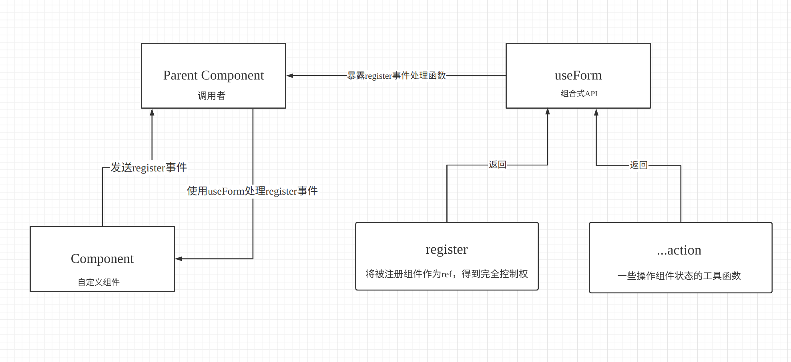

vben-admin 的源码很值得学习！

<!--more-->

### 参数介绍

```javascript
const [register, methods] = useForm(props);
```

**参数 props 内的值可以是 computed 或者 ref 类型**

**register**

`register` 用于注册 `useForm`，如果需要使用 `useForm` 提供的 api，必须将 `register` 传入组件的 `onRegister`

```vue
<template>
  <BasicForm @register="register" @submit="handleSubmit" />
</template>
<script>
  export default defineComponent({
    components: { BasicForm },
    setup() {
      const [register, methods] = useForm({
          // ...initConfig 这里传入组件需要的数据
      });
      return {
        register,
      };
    },
  });
</script>
```

这个组件是经过一层组件再次封装的，内部`BasicForm`组件会触发`register`事件，这里在外部捕获到，交由`useForm`内暴露的`register`函数处理。

这样使得`composition`内部可以得到组件实例，从而暴露出各种操作`BasicForm`内部状态的工具函数。

而之前我一般是传入`组件ref`到`useForm`，对于想要使用组件内部函数，通常是传入回调函数或者直接操作组件，管理起来异常复杂。

不如这样写，不仅可以传入组件ref，还能传入其他组件ref，如 `BasicTable`组件触发 `register` 事件：

```javascript
emit('register', tableAction, formActions);
```

留下当时看源码画的图，希望能找到更符合描述事件驱动的程序源码的图表。



[vbenjs/vue-vben-admin: A modern vue admin. It is based on Vue3, vite and TypeScript. It's fast！ (github.com)](https://github.com/vbenjs/vue-vben-admin)
