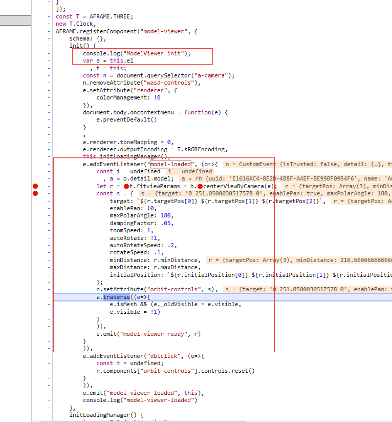
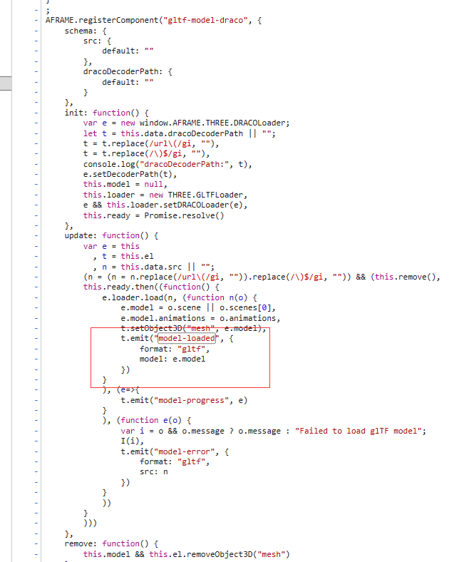

threejs中很多回调套回调，或是需要全局变量共享某个实例，往往容易造成代码写的一团乱麻，或是为了防止变成一团乱麻而写重复代码，这之间如何取舍，需要长久的经验积累。

<!--more-->

之前由于写成一团乱麻，重构了一下，新版不能说有多好，反而导致模块间共享一些上下文变得复杂。

只能说在自己技术没有突破性提升的时候，重构等于啥也没干。

迫于自己水平低下，翻看被Vite打包的大厂员工代码，还能看，至少不是混淆。

## 模型加载

`model-viewer`是`scene`上的属性，可以看做是总体的`init`。

这里除了设置了`renderer`以外，还添加了模型加载完成的事件监听。对的，模型加载后就在这里执行一次回调，继续看是哪里触发了模型加载结束事件——

这里是模型元素上的属性，其属性`src`对应模型路径，`dracoDecoderPath`对应解压模型脚本路径。

这里的`init`只是生成了`loader`，加载模型的操作是在`update`方法，在这里加载模型相较于在`init`，相同的是都会在第一次挂载执行，唯一不同的是`update`在`setAttribute()`时会再次执行。如果需要切换加载模型的时候，便可以将初始化代码区分开。

注意看`this.ready`这个属性对`Promise`的使用，这里没截图声明，目测应该是`new`了一个永远不会`resolve`的`Promise`，而`init`后将其状态改为`resolve`，此时下面`update`的`this.ready.then`便执行。巧妙地利用`Promise`实现事件监听（或是类似等待某种状态）

`gltfLoader`的函数签名大概是这样：

`load(onSuccess, onProgress, onFail)`

看大厂员工写的是三个回调都用事件传出去了，毕竟这里是抽象出来的代码，不要做具体逻辑。

`model-loaded`消息一经发出后，修改材质、添加贴图、动画处理事件处理函数都跑了起来，他们都是独立在其他地方，使用着他们的上下文。

同样的`model-progress、model-error`也有专门的处理器在等着。

其他的我还没来得及看，现在总结一下。

看完之后才发现自己水平差到极点，拿外面上下文只会传参数引用、回调函数，殊不知参数一多搞得人头晕眼花；暴露内部上下文也只会传回调函数，或是少有的几个变量就做引用返回值了。

代码写的千疮百孔，逻辑抽离效益甚微；实现操作只会封装成函数，从而依赖多个模块导致模块间聚合严重，可定制化极低。`init`和`update`不分，重复构建相同对象；上下文暴露困难，经常依赖全局变量。

我自己写的代码就不贴了，反正就是加载gltf模型，各种操作一锅炖