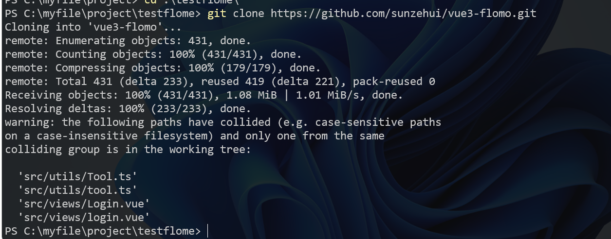
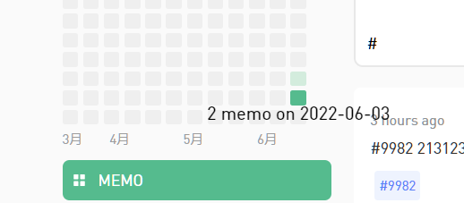
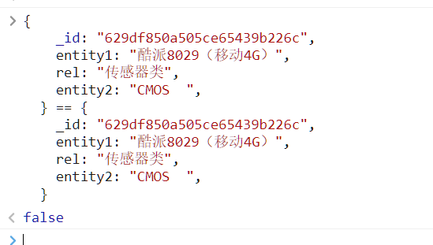

近期踩坑汇总

<!--more-->

## window大小写问题

之前是解决了严格限制大小写问题，但是git仓库里存放的还附带小写的文件，所以需要将之前的小写文件删了，不然克隆到没有设置严格检查大小写的系统上会出错。



解决方法：

```bash
git rm -r --cahced src/views/login.vue
git rm -r --cahced src/views/tool.vue
```


## element-plus 文字提示组件样式问题


之前使用`element-plus`的时候用的按需引入，样式也需要按需引入，这个在window正常用，放到服务器上，编译不通过，网上查了一下是因为vite使用的rollup不支持处理绝对路径，所以要用插件自动引入，也就是	这个：

[element-plus/unplugin-element-plus: 🔌 Import Element Plus on demand. Support Vite, Webpack, Vue CLI, Rollup and esbuild. (github.com)](https://github.com/element-plus/unplugin-element-plus)

这个插件会自动引入样式

```javascript
import { ElButton } from 'element-plus'

//    ↓ ↓ ↓ ↓ ↓ ↓

import { ElButton } from 'element-plus'
import 'element-plus/es/components/button/style/css'
```

解决了我的问题，但有个组件用不了

`tooltip`：



背景色没了，去查引入的文件，在这里：


怎么没有东西？这可是官方仓库！倒是有个tooltip-v2，这个不知道是怎么引入。。

经过一番排查，原来是这个东西继承自`popper`，所以应该先导入`popper`。

```typescript
import { ElTooltip, ElPopper } from "element-plus";

// 为了防止被 shaking
defineExpose({
  ElPopper,
});
```

成功解决


## Array.includes 理解错误


将创建好的节点和边渲染到页面上，竟然有些节点是没有边的


我一直怀疑是生成link的代码有问题，直到我看见创建节点函数的`includes`。

这是创建节点的函数，很简单地写了一下过滤。

```javascript
import { nanoid } from "nanoid";

export const getNode = () => {
    const nodes = [];
    for (let i = 0; i < list.length; i++) {
        const { entity1, entity2 } = list[i];
        if (!nodes.includes(entity1)) {
            nodes.push({
                name: entity1,
                id: nanoid(),
            });
        }
    }
    return nodes;
};
```

`nodes`列表里面存放的是对象，所以不能直接`includes`，要单独判断`name === entity1`。

所以，我这么写：

```javascript
nodes.includes(item => item.name && item.name === entity1)
```

为了防止第一次因没有数据而导致的`item.name is undefined`错误，我还加了判断存在，然而，事情并没有我想象的这么简单。

`Array.includes` 竟然不支持传回调函数！

所以，建议改用`find`或`filter`。

```javascript
if(!nodes.filter(item => item.name && item.name === entity1)){
    // do sth...
}
```

我以为这就完了，控制台又报错了，原来`filter`返回的空数组，布尔值是`true`，取反后就是`false`了。

```javascript
if(nodes.filter(item => item.name && item.name === entity1).length === 0){
    // do sth...
}
```

所以还是直接判断`length`吧。

成功解决！


昨晚写`python`的时候遇到差不多的问题，`python`里的`None`竟然不是`False`！


## 总结

为什么`Array.inlcudes`不支持传回调函数？

为什么我会觉得它能传回调函数？

我查了一下`lodash`的魔改`includes`，发现它也是不支持传回调函数的，倒是可以传对象，像这样：

```javascript
_.includes([1, 2, 3], 1);
// => true
 
_.includes([1, 2, 3], 1, 2);
// => false
 
_.includes({ 'user': 'fred', 'age': 40 }, 'fred');
// => true
 
_.includes('pebbles', 'eb');
// => true
```

或许原生`includes`支持对象浅比较？试了一下发现不行


也不是模糊搜索，后来我才想起来，两个对象比较是比较内存地址。。



